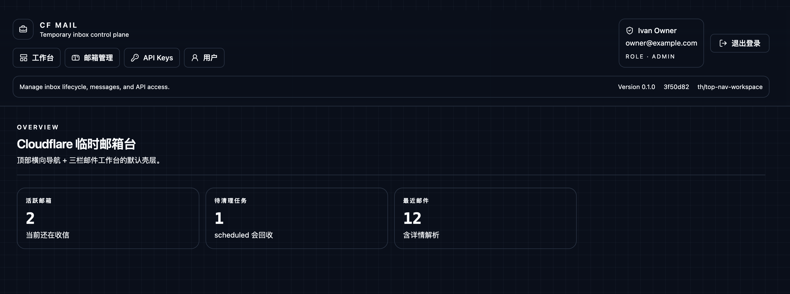
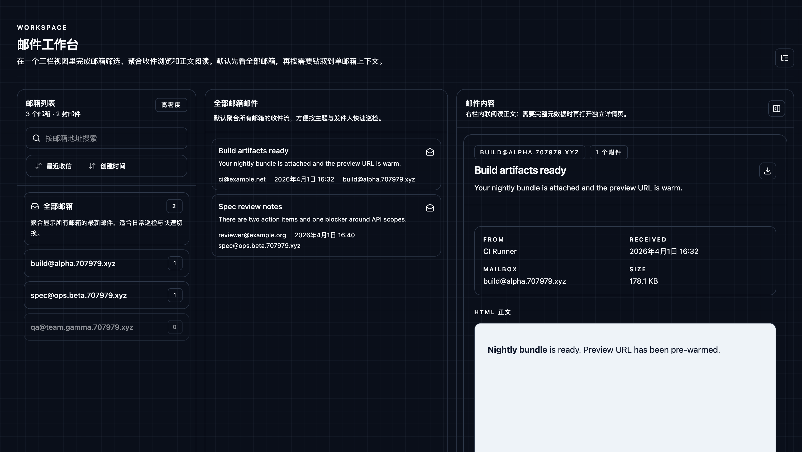
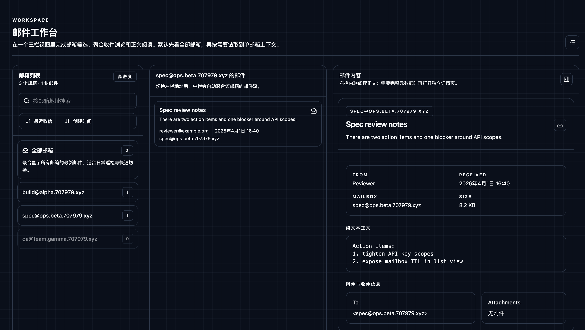
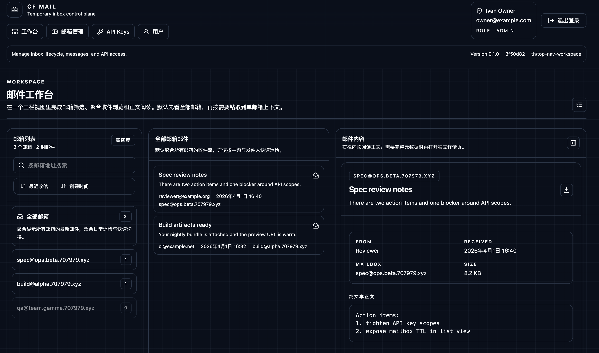
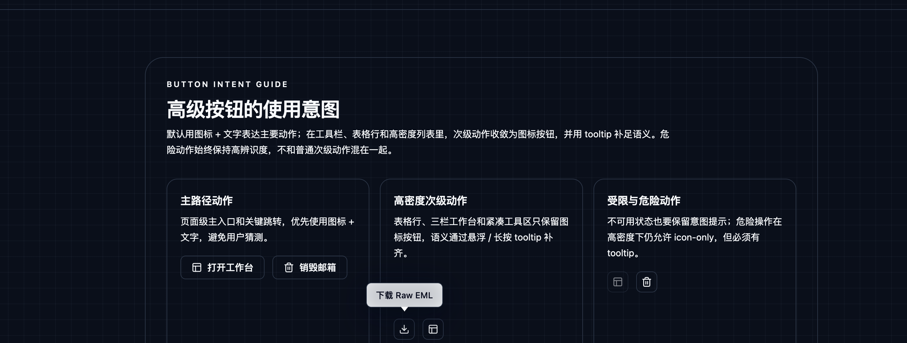
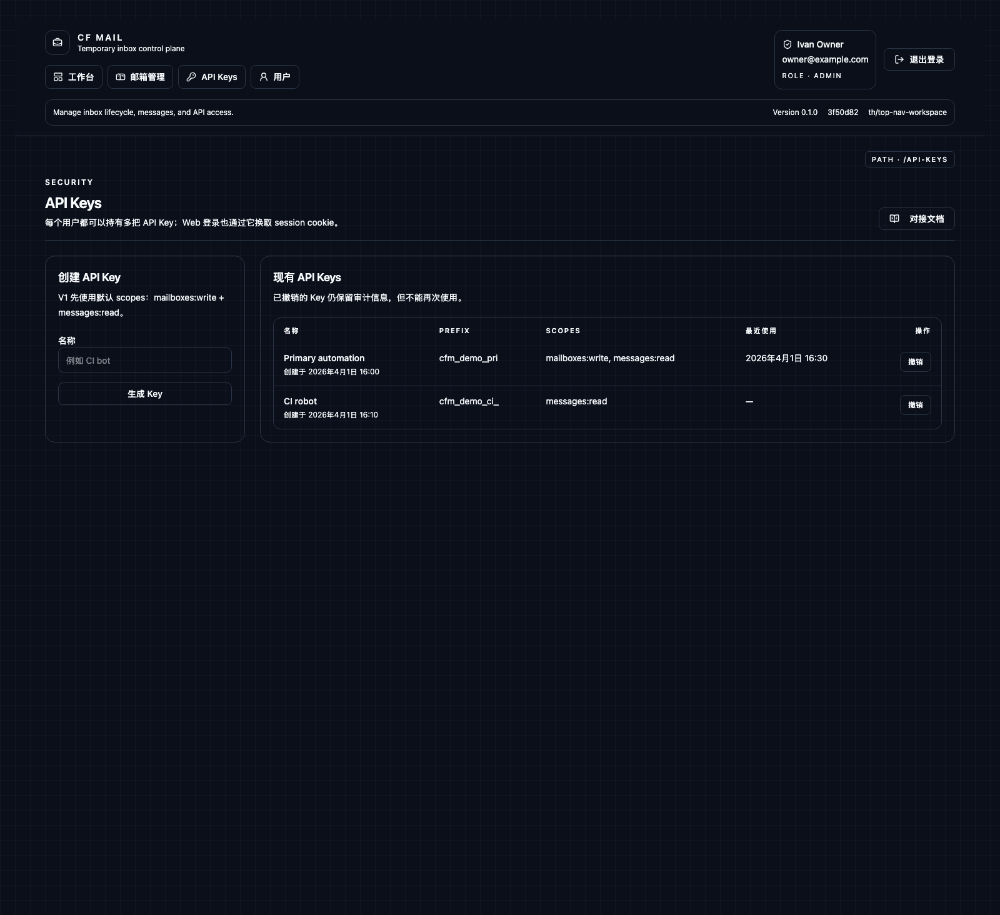
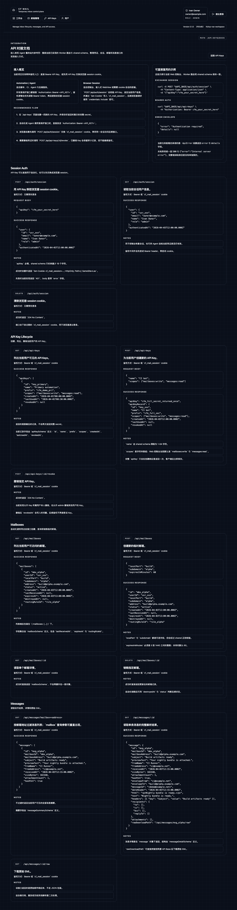

# CF Mail V1 Spec

## Objective

Deliver a Cloudflare-based temporary mailbox control plane with a compact, tool-oriented web console for login, mailbox lifecycle management, message inspection, API key management, and multi-user administration.

## Product Surfaces

### Auth
- `/login`
- API key based sign-in that exchanges credentials for a browser session

### Workspace
- `/workspace`
- Three-pane mail workbench for mailbox filtering, aggregated message browsing, and inline message reading
- URL search params persist mailbox scope, message selection, sort mode, and mailbox search query

### Mailboxes
- `/mailboxes`
- `/mailboxes/:mailboxId`
- Lightweight mailbox inventory and lifecycle management surface
- Message browsing is no longer embedded here; mailbox rows and compatibility routes hand off to the workspace

### Messages
- `/messages/:messageId`
- Inspect parsed message content, HTML preview, plain text, headers, recipients, attachments, and raw EML download
- Legacy-compatible detail route that can reopen the same message inside the workspace

### Security
- `/api-keys`
- `/api-keys/docs`
- Create and revoke API keys for automation and browser sign-in
- Protected integration reference for human operators and Agents, covering session exchange, API key lifecycle, mailbox endpoints, and message endpoints

### Users
- `/users`
- Admin-only user management with initial key issuance

## UI Direction

- Dark, minimal, utility-first control plane
- Dense information layout optimized for repeated operational tasks
- Sticky top navigation with clear active state, account context, logout, and skip-to-content affordance
- Desktop-first three-pane workbench for mailbox list, message list, and inline message content
- Workspace mailbox rail supports all-mailbox aggregation, mailbox search, and sorting by recent receive time or create time
- Mailbox management surface is intentionally list-first and minimal; email reading flows jump back into the workspace
- Buttons, badges, and similar compact UI labels must stay on a single line
- Reusable advanced action button primitive: icon + text by default, but secondary actions collapse to icon-only in dense layouts
- Icon-only actions use a mature third-party tooltip with long-press / hover reveal and collision-aware floating placement
- Mailbox presentation removes textual lifecycle badges; the workspace rail uses right-aligned numeric badges while mailbox tables show unread / total counts
- Mailbox rail rows stay single-line and navigation-focused; verbose lifecycle metadata is removed from the dense workspace list
- Destroyed mailboxes collapse to a muted single-line row in dense lists to avoid wasting vertical space
- Table-first detail and management pages remain available as compatibility surfaces
- Cool gray embedded HTML mail preview surface to reduce glare while preserving message fidelity

## Visual Evidence

Evidence is persisted with this spec and refreshed whenever the rendered control-plane surfaces change.

### App Shell

### Workspace

### UI Primitives

### Mailboxes

### Mailbox Detail

### API Key Management

### Integration Reference

