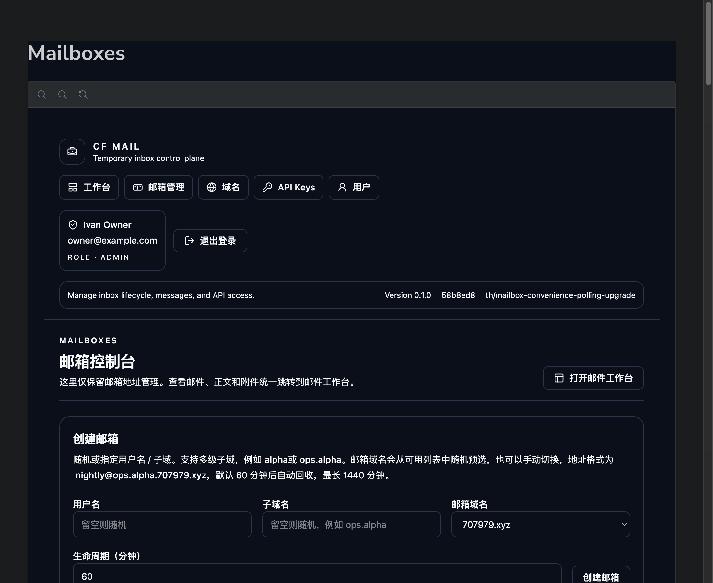
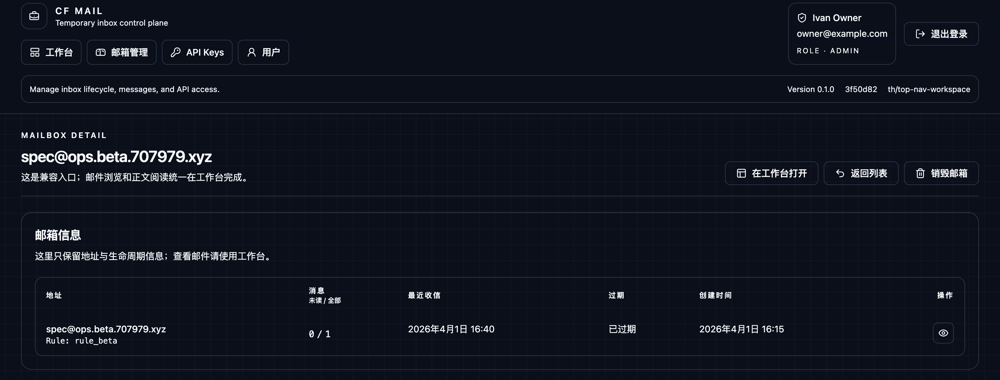
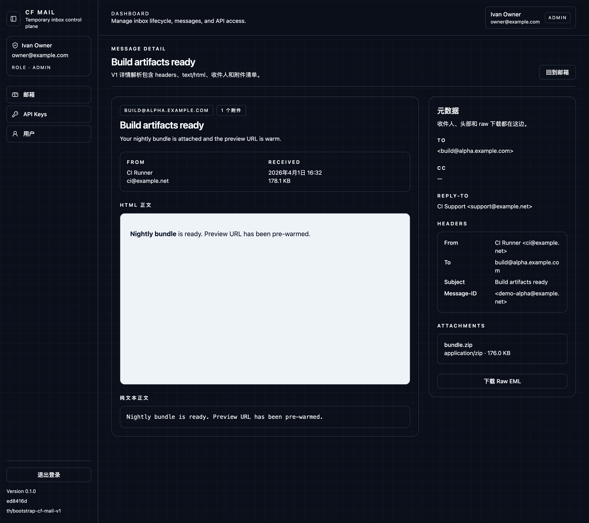

# CF Mail V1 Spec

## Objective

Deliver a Cloudflare-based temporary mailbox control plane with a compact, tool-oriented web console for login, mailbox lifecycle management, message inspection, API key management, and multi-user administration.

## Product Surfaces

### Auth
- `/login`
- API key based sign-in that exchanges credentials for a browser session

### Mailboxes
- `/mailboxes`
- `/mailboxes/:mailboxId`
- Create temporary mailboxes, inspect lifecycle state, and destroy active addresses

### Messages
- `/messages/:messageId`
- Inspect parsed message content, HTML preview, plain text, headers, recipients, attachments, and raw EML download

### Security
- `/api-keys`
- Create and revoke API keys for automation and browser sign-in

### Users
- `/users`
- Admin-only user management with initial key issuance

## UI Direction

- Dark, minimal, utility-first control plane
- Dense information layout optimized for repeated operational tasks
- Sidebar navigation with persistent page context
- Table-first data presentation with compact actions
- Cool gray embedded HTML mail preview surface to reduce glare while preserving message fidelity

## Visual Evidence

Evidence is bound to local `HEAD` `845be4fe9e382e4d3af7f05bca2b826d3c00ccd8`.

### Login

### Mailboxes

### Mailbox Detail

### Message Detail

### API Keys

### Users

